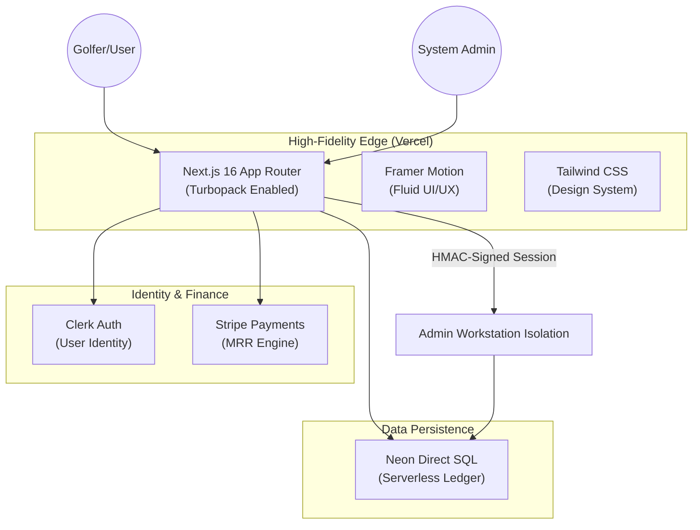
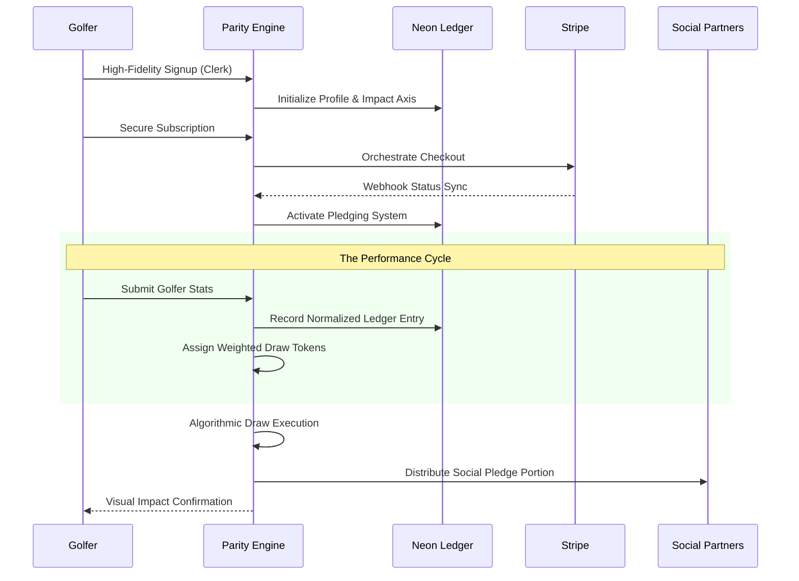

# Parity: Impact Golfing ⛳️

**Parity** is a high-fidelity golfing performance and social impact platform. It bridges the gap between individual golfing excellence and global social responsibility by transforming every drive and putt into tangible world impact.

---

## 🏛 System Architecture

The Parity ecosystem is built on a modern, serverless architecture that prioritizes absolute performance and high-density data integrity.



---

## 🔄 User Lifecycle: The Golf-to-Impact Flow

The journey transitions from performance tracking to community impact through an integrated weighted draw engine.



---

## 🛠 Tech Stack Specification

- **Framework**: [Next.js 16](https://nextjs.org/) (App Router, Turbopack, React Server Components)
- **Styling**: [Tailwind CSS](https://tailwindcss.com/) with a custom Dark-Mode Design System
- **Animation**: [Framer Motion](https://www.framer.com/motion/) for silk-smooth UI transitions
- **Database**: [Neon Postgres](https://neon.tech/) (Direct SQL Architecture)
- **Authentication**: [Clerk](https://clerk.dev/) (User) & Custom [HMAC/Crypto-Scrypt](https://nodejs.org/api/crypto.html) (Admin Isolation)
- **Payments**: [Stripe](https://stripe.com/) for subscription and recurring impact management

---

## ⚡️ Key Capabilities

- **Impact Hub**: Integrated management of global charity partners and social pledge axes.
- **Score Ledger**: Real-time performance tracking with high-fidelity visualization on the Golfer Dashboard.
- **Admin Command Station**: A 100% mobile-responsive, isolated administrative terminal for audits, draw engine management, and user provisioning.
- **Real-Time MRR Audit**: Live performance reporting of platform growth and charitable impact distribution.

---

## 🚀 Getting Started

### Prerequisites
- Node.js 18+
- Neon.tech Database URL
- Clerk and Stripe API Keys

### Installation
```bash
# 1. Install Dependencies
npm install

# 2. Configure Environment
cp .env.example .env

# 3. Secure Administrative Seeding
# Perform an administrative handshake to populate platform records
node actions/seed.js

# 4. Initiate Development
npm run dev
```

---

## 🔒 Security & Privacy
Parity maintains a **strict isolation policy** between the administrative workstation and the user platform. All administrative sessions are HMAC-signed and monitored on the Neon Direct Ledger for absolute transparency and auditability.

---

© 2026 Parity Technologies. Optimized for absolute golfing performance and global impact.
